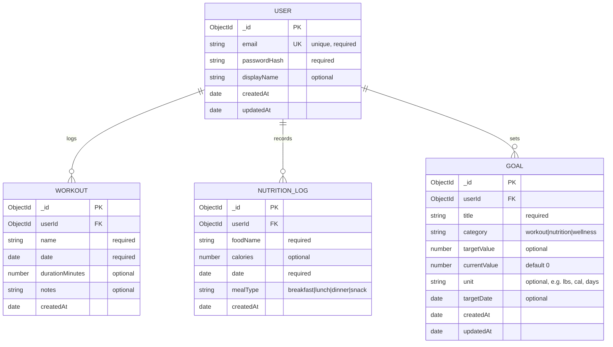

# Database Entity Relationship Diagram

Sprint 1 (User Story #4) and Sprint 2 (User Story #11) deliverable.

## ERD (MVP)

## Collection Summary

| Collection | Purpose | MVP scope |
|------------|---------|-----------|
| `users` | Authentication and account identity | Required for auth sprint |
| `workouts` | Exercise session records | Schema planned; CRUD later |
| `nutrition_logs` | Food and calorie entries | Schema planned; CRUD later |
| `goals` | User-defined wellness targets | Schema planned; CRUD later |

## Relationships

- Every `workout`, `nutrition_log`, and `goal` document belongs to exactly one `user` via `userId`.
- Deleting a user should eventually cascade or block if dependent records exist (future decision).
- Indexes planned: unique index on `users.email`; compound index on `(userId, date)` for workouts and nutrition logs.

## Design Principles (from sprint grooming)

1. Keep the MVP schema simple enough to implement in one semester.
2. Use references (`userId`) rather than embedding large arrays on the user document.
3. Leave room for progress analytics by storing dated records on workouts and nutrition logs.
4. Avoid premature normalization; MongoDB document model fits per-user fitness data.
