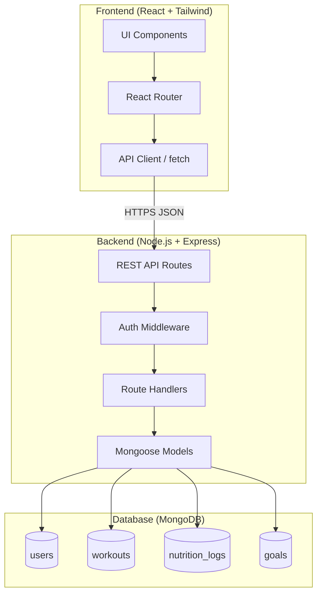
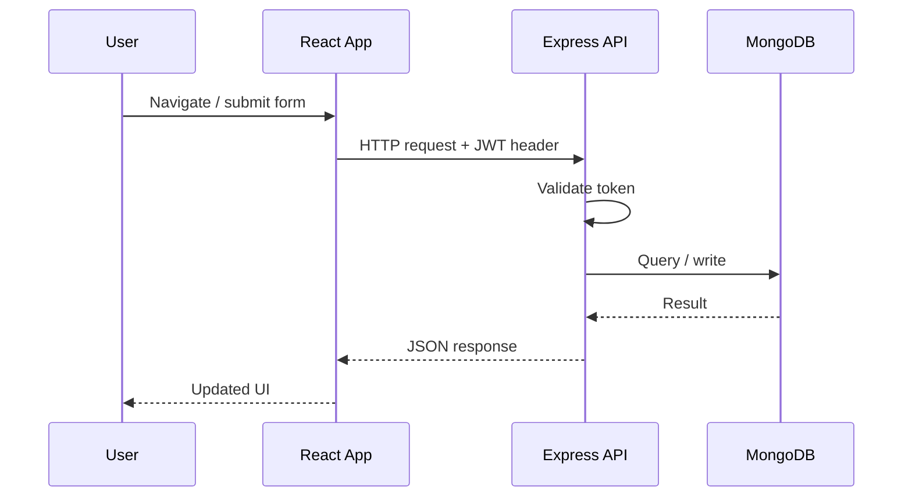

# System Architecture Diagram

Sprint 2 (User Story #8) and Sprint 3 (User Story #15). MVP three-tier layout and module context.

Module details: [../docs/component-planning.md](../docs/component-planning.md).

## High-Level Architecture

## Component Responsibilities

| Layer | Technology | Responsibility |
|-------|------------|----------------|
| Frontend | React, Tailwind CSS, Vite | Pages, forms, navigation, dashboard shell, API calls |
| Backend | Node.js, Express | REST endpoints, validation, authentication, business rules |
| Database | MongoDB, Mongoose | Persistent storage for users and fitness data |

## Major API Surface (planned)

| Area | Base path | Purpose |
|------|-----------|---------|
| Health | `GET /api/health` | Server status check |
| Auth | `/api/auth/*` | Signup, login, logout, session |
| Workouts | `/api/workouts/*` | Workout logging (future sprint) |
| Nutrition | `/api/nutrition/*` | Nutrition logging (future sprint) |
| Goals | `/api/goals/*` | Goal tracking (future sprint) |

## Data Flow (authenticated request)

## Current Implementation Status (Sprint 3)

| Component | Status |
|-----------|--------|
| `GET /api/health` | Implemented |
| Mongoose models (User, Workout, NutritionLog, Goal) | Implemented |
| Auth routes + JWT middleware | Planned Sprint 4 |
| Feature CRUD routes | Planned Sprint 4–5 |
| React pages + navigation shell | Implemented |
| Auth context + protected routes | Planned Sprint 4 |

## Design Notes

- MVP keeps a single backend service; no microservices.
- Frontend and backend run separately during development (Vite dev server + Express).
- Authentication uses JWT stored client-side for the starter template; may move to httpOnly cookies later.
- All user-owned records include a `userId` reference for data isolation.
