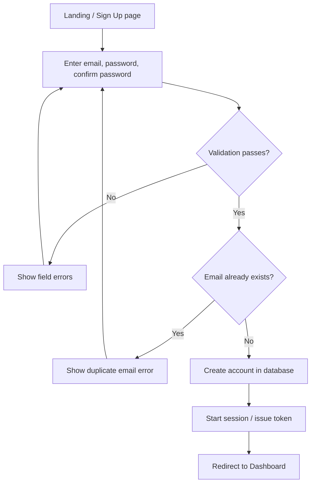
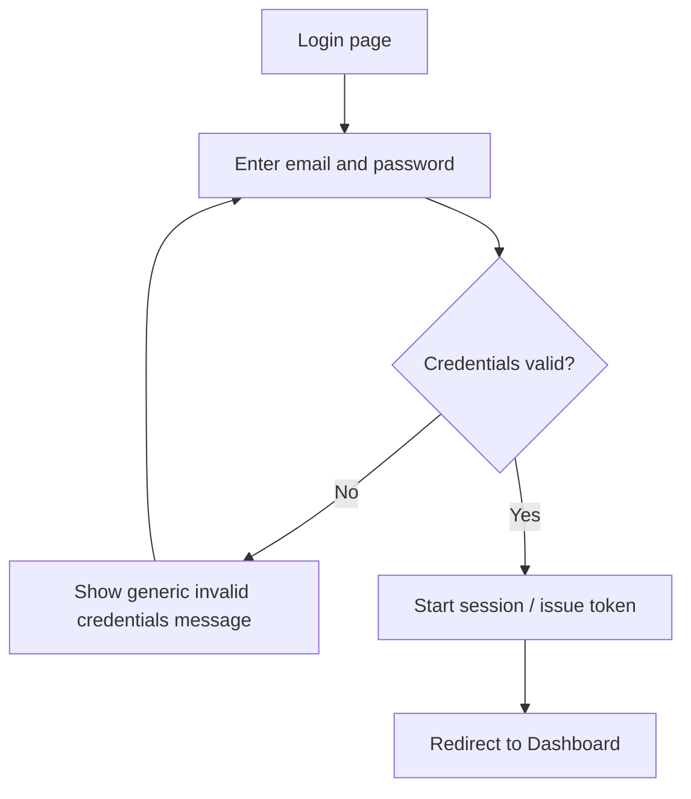
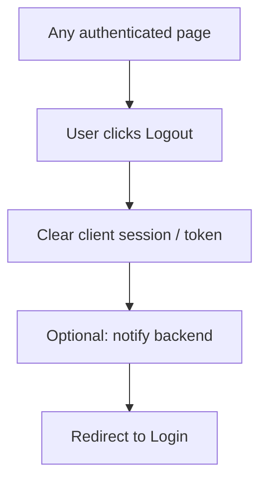
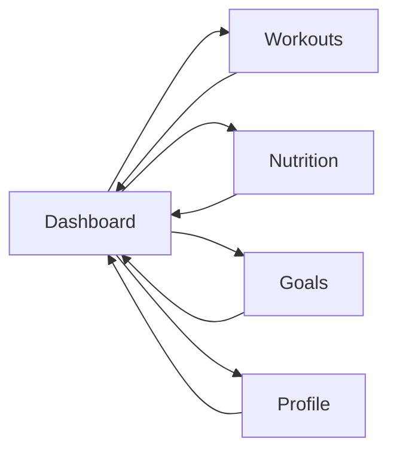
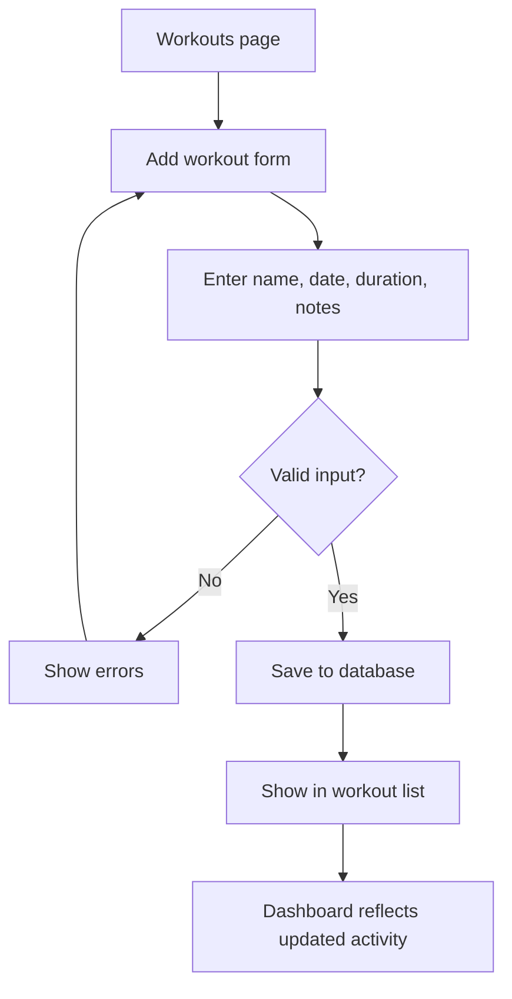
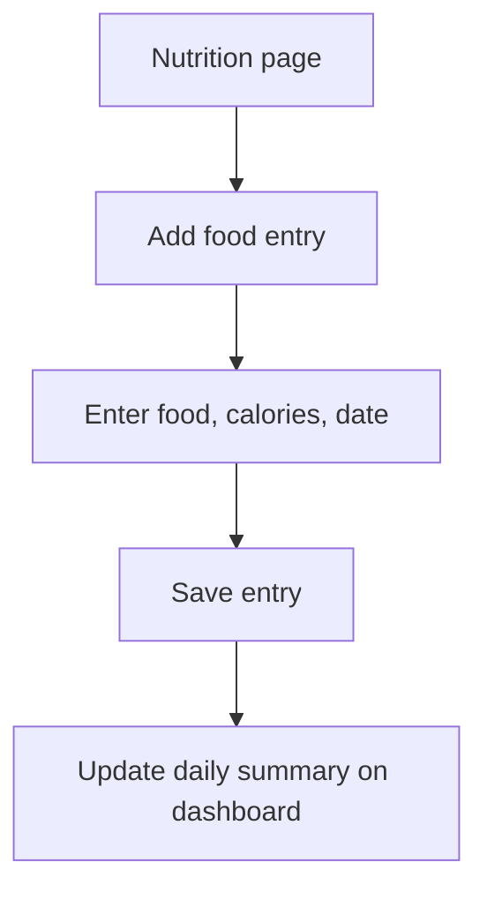
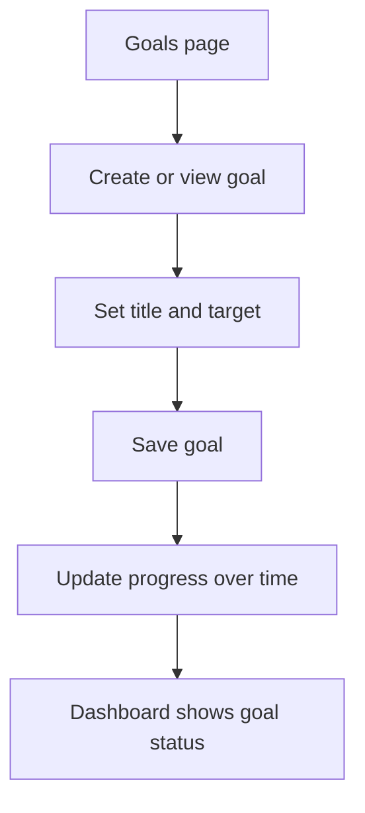

# User Workflow Diagrams

Sprint 2 deliverable (User Story #9). Major MVP user journeys aligned with wireframes and backlog grooming.

## 1. New User Registration

**Outcome:** User has an account and an active session.

## 2. Returning User Login

**Outcome:** User reaches the dashboard with a persisted session.

## 3. Logout

**Outcome:** Session ends; protected routes require login again.

## 4. Dashboard Navigation (MVP)

**Outcome:** User can reach all major MVP sections from one hub.

## 5. Log Workout (planned — future sprint)

## 6. Track Nutrition (planned — future sprint)

## 7. Manage Goals (planned — future sprint)

## Workflow Alignment

| Workflow | Sprint status | Wireframe section |
|----------|---------------|-------------------|
| Signup / Login / Logout | Documented; starter template next | Auth pages |
| Dashboard navigation | Documented; shell in starter | Dashboard, nav bar |
| Workout logging | Planned Sprint 3+ | Workouts |
| Nutrition tracking | Planned Sprint 3+ | Nutrition |
| Goal tracking | Planned Sprint 3+ | Goals |
| Profile | MVP: view only first | Profile |
