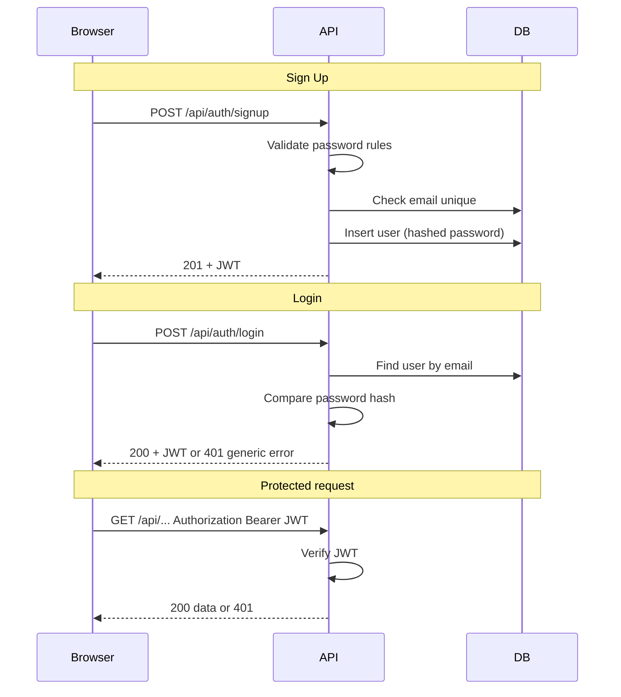

# Authentication & User Accounts

Sprint 1 (User Story #5) and Sprint 2 (User Story #12). Requirements and acceptance criteria from backlog grooming.

## Overview

Authentication keeps personal fitness and wellness data private. The MVP uses email/password login with server-side password hashing and JWT-based sessions in the starter template.

## User Account Fields (MVP)

| Field | Required | Notes |
|-------|----------|-------|
| `email` | Yes | Unique, used for login |
| `password` | Yes | Never stored plain text; bcrypt hash only |
| `displayName` | No | Optional; shown on dashboard |
| `createdAt` | Auto | Set on registration |

## Sign Up Requirements

1. Form collects: email, password, password confirmation.
2. Client and server both validate input before creating an account.

### Password Rules

- Minimum 8 characters
- At least 1 number
- At least 1 symbol (non-alphanumeric character)

### Sign Up Acceptance Criteria

| # | Criterion | Implementation note |
|---|-----------|---------------------|
| 1 | Signup requires email, password, and password confirmation | All three fields required on form and API |
| 2 | Password must meet complexity rules | Regex validation on client and server |
| 3 | Duplicate emails show a clear error | Check unique index on `users.email` |
| 4 | Successful signup starts a session | Issue JWT and redirect to dashboard |

## Login Requirements

1. Form collects: email, password.
2. Server compares password to stored hash.

### Login Acceptance Criteria

| # | Criterion | Implementation note |
|---|-----------|---------------------|
| 1 | Valid credentials start a session | JWT issued on success |
| 2 | Invalid credentials show a **generic** error | e.g. "Invalid email or password" — do not reveal which field failed |
| 3 | Session remains active after login | Token stored client-side until logout or expiry |

## Logout Requirements

| # | Criterion | Implementation note |
|---|-----------|---------------------|
| 1 | Logout ends the session | Remove token from client storage |
| 2 | User is redirected to login | Protected routes inaccessible without new login |

## Protected Routes

Pages that require authentication:

- `/dashboard`
- `/workouts`
- `/nutrition`
- `/goals`
- `/profile`

Unauthenticated users visiting these paths are redirected to `/login`.

Public routes:

- `/login`
- `/signup`
- `/` (redirects to dashboard if logged in, else login)

## Authentication Workflow

## Security Practices (MVP)

- Passwords hashed with bcrypt (cost factor ≥ 10).
- JWT signed with server secret (`JWT_SECRET` in environment).
- Generic login errors to reduce account enumeration.
- HTTPS required in production (deployment sprint).

## Out of Scope for MVP (documented for future sprints)

- Email verification
- Password reset flow
- OAuth (Google, Apple, etc.)
- Two-factor authentication
- Refresh tokens / token rotation
- Rate limiting and account lockout

## API Endpoints (planned)

| Method | Path | Auth | Description |
|--------|------|------|-------------|
| POST | `/api/auth/signup` | No | Register new user |
| POST | `/api/auth/login` | No | Authenticate user |
| POST | `/api/auth/logout` | Yes | End session (client + optional server denylist later) |
| GET | `/api/auth/me` | Yes | Return current user profile |
