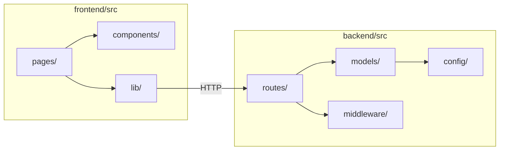

# Component & Module Planning

Sprint 3 deliverable (User Story #19). Maps application modules to repo folders and describes how they interact.

## Module Overview

## Frontend Modules

| Module | Path | Responsibility | Sprint |
|--------|------|----------------|--------|
| **Routing** | `App.jsx` | Route definitions, layout nesting | 3 ✓ |
| **Layout** | `components/AppLayout.jsx` | Header, nav, outlet for child pages | 3 ✓ |
| **Shared UI** | `components/PageCard.jsx`, `PlaceholderPanel.jsx` | Reusable cards and empty states | 3 ✓ |
| **API client** | `lib/api.js` | Base URL, health check, future auth helpers | 3 ✓ |
| **Auth context** | `context/AuthContext.jsx` | Token storage, user state, login/logout | 4 ✓ |
| **Protected route** | `components/ProtectedRoute.jsx` | Redirect unauthenticated users | 4 ✓ |
| **Form field** | `components/FormField.jsx` | Shared labeled inputs | 4 ✓ |
| **Pages — auth** | `pages/LoginPage.jsx`, `SignupPage.jsx` | Auth forms | 4 ✓ |
| **Pages — app** | `DashboardPage`, `WorkoutsPage`, etc. | Feature screens | 3 shell / 4–5 data |

### Page-to-Route Map

| Route | Page component | Auth required |
|-------|----------------|---------------|
| `/` | `HomePage` | No |
| `/login` | `LoginPage` | No |
| `/signup` | `SignupPage` | No |
| `/dashboard` | `DashboardPage` | Yes (Sprint 4) |
| `/workouts` | `WorkoutsPage` | Yes |
| `/nutrition` | `NutritionPage` | Yes |
| `/goals` | `GoalsPage` | Yes |
| `/profile` | `ProfilePage` | Yes |

## Backend Modules

| Module | Path | Responsibility | Sprint |
|--------|------|----------------|--------|
| **App entry** | `index.js` | Express setup, CORS, middleware, listen | 3 ✓ |
| **Database** | `config/db.js` | MongoDB connection | 3 ✓ |
| **Health** | `routes/health.js` | `GET /api/health` | 3 ✓ |
| **Auth routes** | `routes/auth.js` | Signup, login, logout, me | 4 ✓ |
| **Auth middleware** | `middleware/auth.js` | JWT verification | 4 ✓ |
| **Validation** | `middleware/validate.js` *(planned)* | Request body checks | 4 |
| **Error handler** | `middleware/errorHandler.js` | Consistent JSON errors | 3 ✓ |
| **User model** | `models/User.js` | Account storage | 3 ✓ |
| **Workout model** | `models/Workout.js` | Workout documents | 3 ✓ |
| **Nutrition model** | `models/NutritionLog.js` | Nutrition documents | 3 ✓ |
| **Goal model** | `models/Goal.js` | Goal documents | 3 ✓ |
| **Feature routes** | `routes/workouts.js`, etc. *(planned)* | CRUD per collection | 4–5 |

## Cross-Module Interactions

### Authentication flow (Sprint 4)

1. `SignupPage` → `lib/api.js` → `routes/auth.js` → `models/User.js`
2. JWT returned → stored in `AuthContext` → attached to subsequent `fetch` calls
3. `ProtectedRoute` reads context; `middleware/auth.js` validates on server

### Workout logging flow (Sprint 4–5)

1. `WorkoutsPage` form → `lib/api.js` → `routes/workouts.js`
2. `middleware/auth.js` extracts `userId` from JWT
3. `models/Workout.js` saves with `userId` filter on all queries

## Team Ownership (Sprint 3 planning)

| Member | Primary modules |
|--------|-----------------|
| Alejandro Perez | Architecture docs, roadmap, repo organization |
| Ahanaf Akif | Database models, auth API (planned), schema docs |
| Josue Gamon Fortes | Wireframes, page components, UX flows |
| Allen Cruz | Component docs, architecture diagrams, GitHub board |

## Documentation Links

Each module should reference:

- API contracts → [authentication.md](./authentication.md), future `docs/api.md`
- Data shape → [database-schema.md](./database-schema.md)
- UI layout → [wireframes.md](./wireframes.md)
- System context → [../diagrams/system-architecture.md](../diagrams/system-architecture.md)

## Maintenance Rules

1. New route files get mounted in `routes/index.js`.
2. New pages get a route in `App.jsx` and an entry in this document.
3. New Mongoose models update ERD and `database-schema.md`.
4. Keep module count flat — no extra abstraction layers until CRUD is working.
