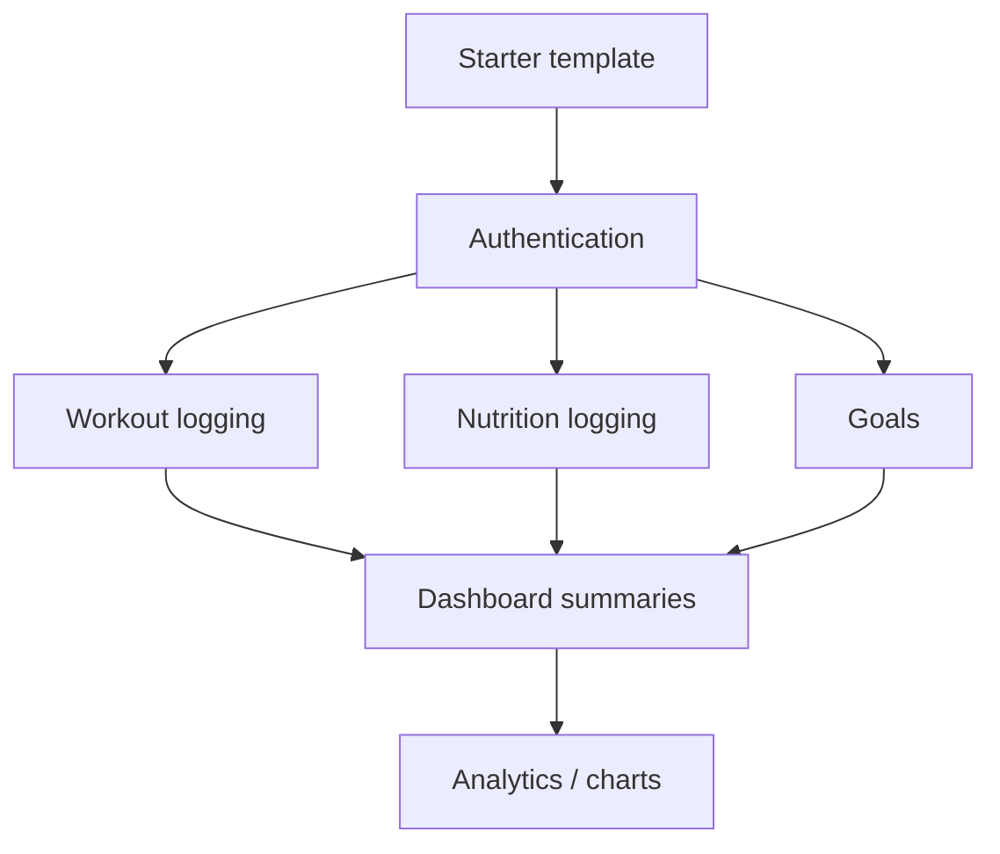

# MVP Implementation Roadmap

Sprint 3 deliverable (User Story #20). Sequences development work after planning sprints so the team can implement features in organized vertical slices.

## Current State

| Area | Status |
|------|--------|
| Repository and folder structure | Done |
| Architecture, workflow, and ERD diagrams | Done |
| Auth requirements and acceptance criteria | Documented |
| Mongoose models (User, Workout, NutritionLog, Goal) | Scaffolded |
| React + Tailwind starter with navigation shell | Scaffolded |
| Auth API and protected routes | Planned — Sprint 4 |
| Feature CRUD (workouts, nutrition, goals) | Planned — Sprint 4–5 |

## Implementation Phases

### Phase 1 — Foundation (Sprint 3, complete)

**Goal:** Planning artifacts and starter code ready for feature development.

| Task | Owner focus | Deliverable |
|------|-------------|-------------|
| Finalize architecture docs | Alejandro, Allen | `diagrams/system-architecture.md` |
| Component/module planning | Ahanaf, Allen | `docs/component-planning.md` |
| Workflow and journey docs | Josue | `diagrams/user-workflows.md`, `docs/user-journeys.md` |
| Wireframe refinement | Josue | `docs/wireframes.md` |
| Database planning finalization | Ahanaf | `docs/database-schema.md`, `diagrams/database-erd.md` |
| Implementation roadmap | Alejandro | This document |
| Starter template | Team | `backend/`, `frontend/` |

**Exit criteria:** All Sprint 3 user stories (#15–#21) documented; `npm run dev` works for both apps.

### Phase 2 — Authentication (Sprint 4)

**Goal:** Users can sign up, log in, log out, and access protected pages.

| Task | API | UI |
|------|-----|-----|
| Password validation utility | `POST /api/auth/signup` | Signup form (live) |
| Login + JWT issuance | `POST /api/auth/login` | Login form (live) |
| Session check | `GET /api/auth/me` | Auth context provider |
| Logout | `POST /api/auth/logout` | Header logout button |
| Route guards | Auth middleware | `ProtectedRoute` wrapper |

**Depends on:** [authentication.md](./authentication.md) acceptance criteria.

**Exit criteria:** New user can register, land on dashboard, refresh page and stay logged in, log out.

### Phase 3 — Workout & Nutrition Logging (Sprint 4–5)

**Goal:** Users can create and view their own workout and nutrition entries.

| Task | API | UI |
|------|-----|-----|
| List/create workouts | `GET/POST /api/workouts` | Workouts list + add form |
| List/create nutrition logs | `GET/POST /api/nutrition` | Nutrition list + add form |
| Edit/delete (optional MVP) | `PUT/DELETE` routes | Inline edit or modal |

**Depends on:** Phase 2 auth; [wireframes.md](./wireframes.md) workout/nutrition sections.

**Exit criteria:** Entries persist in MongoDB and appear only for the owning user.

### Phase 4 — Goals & Dashboard Summaries (Sprint 5)

**Goal:** Users set goals and see high-level progress on the dashboard.

| Task | API | UI |
|------|-----|-----|
| Goal CRUD | `/api/goals` | Goals page |
| Dashboard aggregates | `/api/dashboard/summary` or client-side | Summary cards on dashboard |
| Profile view | `GET /api/auth/me` | Profile page with user fields |

**Exit criteria:** Dashboard shows counts or recent activity; at least one goal can be created and updated.

### Phase 5 — Polish & Demo (Sprint 6, if time)

- Form validation UX improvements
- Loading and error states on all pages
- Basic progress charts (stretch)
- Deployment notes for capstone demo

## Feature Dependency Graph

## Risk & Scope Controls

| Risk | Mitigation |
|------|------------|
| Scope creep on analytics | Defer charts until logging works; see [mvp-scope.md](./mvp-scope.md) |
| Over-detailed architecture | Keep diagrams MVP-focused per Sprint 3 daily scrum agreement |
| Database complexity | No separate progress collection; derive from workouts/goals queries |
| Auth security gaps | Follow documented password rules; no OAuth in MVP |

## Sprint 4 Backlog Preview (grooming-ready)

| ID | Story | Points (est.) |
|----|-------|---------------|
| 22 | Implement signup and login API | 5 |
| 23 | Wire auth forms and protected routes | 5 |
| 24 | Add logout and session persistence | 3 |
| 25 | Workout list and create API + UI | 5 |
| 26 | Nutrition list and create API + UI | 5 |

## Related Documents

- [mvp-scope.md](./mvp-scope.md) — in/out of scope
- [component-planning.md](./component-planning.md) — module ownership
- [user-stories.md](./user-stories.md) — sprint story index
- [authentication.md](./authentication.md) — auth acceptance criteria
