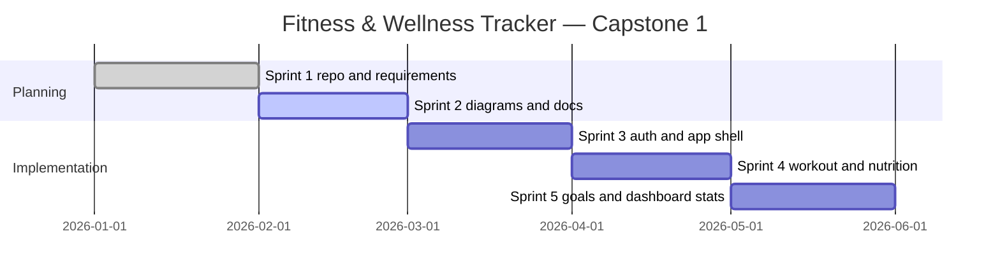

# MVP Scope & Feature Prioritization

Sprint 2 deliverable (User Story #13). Defines what is in the MVP and what is deferred.

## MVP Goal

A web app where users can create an account, log in securely, and navigate a dashboard that will eventually surface workouts, nutrition, goals, and profile — with core data models and architecture ready for feature sprints.

## In Scope (MVP)

| Priority | Feature | Sprint target | Status |
|----------|---------|---------------|--------|
| P0 | Project repo, docs, diagrams | Sprint 1–2 | In progress |
| P0 | Tech stack: React, Express, MongoDB, Tailwind | Sprint 1 | Decided |
| P0 | Authentication (signup, login, logout, session) | Sprint 3 | Documented |
| P0 | Dashboard + navigation shell | Sprint 3 | Wireframed |
| P1 | Workout logging (CRUD) | Sprint 3–4 | Schema planned |
| P1 | Nutrition logging (CRUD) | Sprint 3–4 | Schema planned |
| P1 | Goals (create, view, basic progress) | Sprint 4 | Schema planned |
| P2 | Profile view (email, display name) | Sprint 4 | Wireframed |
| P2 | Basic dashboard summaries | Sprint 4–5 | Planned |

## Out of Scope (Future Sprints)

| Feature | Reason |
|---------|--------|
| Charts and advanced analytics | Sprint 1 grooming: lower priority until core logging exists |
| Social features / sharing | Not required for capstone MVP |
| Wearable integrations | Complexity beyond semester scope |
| Email verification / password reset | Documented in auth.md as post-MVP |
| Admin panel | Single-user focus per account |
| Native mobile apps | Responsive web only |

## Non-Functional Requirements (from requirements.md)

- **Responsive:** Usable on mobile and desktop (Tailwind breakpoints).
- **Secure:** Hashed passwords, protected routes, user-scoped data.
- **Simple navigation:** Five main sections max in primary nav.

## Semester Roadmap (tentative)

## Definition of Done (implementation stories)

A feature is done when:

1. Acceptance criteria from the user story are met.
2. API and UI work together in local dev environment.
3. User data is scoped to the logged-in account.
4. README or docs updated if setup steps change.
5. Demonstrable in sprint review.

## Team Agreements

- Keep MVP scope manageable for a four-person capstone team.
- Prefer working vertical slices (e.g. login end-to-end) over horizontal-only work.
- Document decisions in `docs/` before expanding scope.
