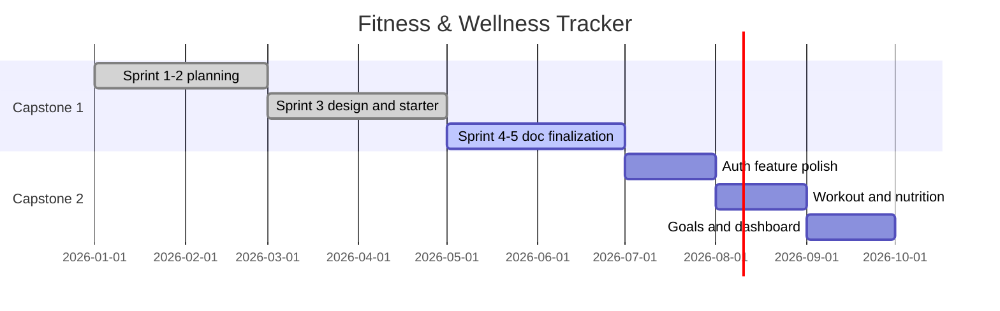

# MVP Scope & Feature Prioritization

Written during Sprint 2 (#13) and updated in Sprint 3 (#20) and Sprint 5 (#33). This is what our team agreed the app should do for the full capstone — not all of it is built yet.

## Capstone 1 vs Capstone 2

Capstone 1 (Sprints 1–5): planning, diagrams, wireframes, API/DB docs, scrum minutes, and a starter template.

Capstone 2: build workouts, nutrition, goals, and dashboard features.

The starter app only has auth and placeholder pages right now.

## MVP Goal

A web app where users can create an account, log in securely, and track workouts, nutrition, and goals on a dashboard — with user-scoped data in MongoDB.

## In Scope (full MVP — Capstone 1 + 2)

| Priority | Feature | Capstone | Status |
|----------|---------|----------|--------|
| P0 | Project repo, docs, diagrams | 1 | Complete |
| P0 | Tech stack: React, Express, MongoDB, Tailwind | 1 | Done |
| P0 | Architecture, workflows, wireframes, API/DB plans | 1 | Complete (Sprint 5 review in progress) |
| P0 | Starter template (health, models, UI shell) | 1 | Done |
| P0 | Authentication (signup, login, logout, session) | 1 practice / 2 | Done (starter) |
| P0 | Dashboard + navigation shell | 1 | Done (shell) |
| P1 | Workout logging (CRUD) | 2 | Schema + wireframes ready |
| P1 | Nutrition logging (CRUD) | 2 | Schema + wireframes ready |
| P1 | Goals (create, view, basic progress) | 2 | Schema planned |
| P2 | Profile view (email, display name) | 2 | Partial (read-only) |
| P2 | Basic dashboard summaries | 2 | Planned |

## Out of Scope

| Feature | Reason |
|---------|--------|
| Charts and advanced analytics | Lower priority until core logging exists |
| Social features / sharing | Not required for capstone MVP |
| Wearable integrations | Beyond semester scope |
| Email verification / password reset | Post-MVP per `authentication.md` |
| Admin panel | Single-user focus per account |
| Native mobile apps | Responsive web only |

## Non-Functional Requirements

- **Responsive:** Usable on mobile and desktop (Tailwind breakpoints).
- **Secure:** Hashed passwords, protected routes, user-scoped data.
- **Simple navigation:** Five main sections max in primary nav.

## Semester Roadmap

## Definition of Done (Capstone 2 implementation)

1. Acceptance criteria from the user story are met.
2. API and UI work together in local dev.
3. User data is scoped to the logged-in account.
4. README or docs updated if setup steps change.
5. Demonstrable in sprint review.

## Team Agreements

- Capstone 1: document decisions in `docs/`; keep MVP scope realistic.
- Capstone 2: prefer vertical slices (API + UI per feature).
- Follow [implementation-roadmap.md](./implementation-roadmap.md) and [capstone-2-handoff.md](./capstone-2-handoff.md).
