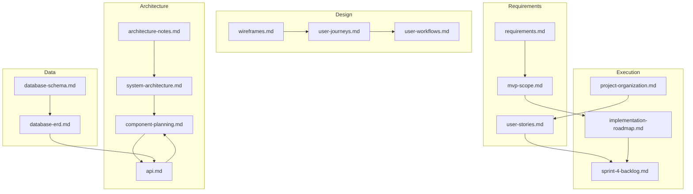

# Planning Artifacts Map

Sprint 3 daily scrum 7 deliverable — connects architecture, workflows, components, database, and implementation docs so the team can move from planning to development without gaps.

## Artifact relationships

## Where to look for…

| Question | Start here |
|----------|------------|
| What is in the MVP? | [mvp-scope.md](./mvp-scope.md) |
| What sprint are we on? | [user-stories.md](./user-stories.md) |
| How should pages look? | [wireframes.md](./wireframes.md) |
| How does a user move through the app? | [user-journeys.md](./user-journeys.md), [user-workflows.md](../diagrams/user-workflows.md) |
| How do frontend/backend connect? | [system-architecture.md](../diagrams/system-architecture.md) |
| Which file owns which feature? | [component-planning.md](./component-planning.md) |
| What fields are in the database? | [database-schema.md](./database-schema.md), [database-erd.md](../diagrams/database-erd.md) |
| What endpoints exist? | [api.md](./api.md) |
| What do we build next? | [sprint-4-backlog.md](./sprint-4-backlog.md), [implementation-roadmap.md](./implementation-roadmap.md) |
| How does the team organize work? | [project-organization.md](./project-organization.md) |
| Auth rules and acceptance tests | [authentication.md](./authentication.md) |

## Code ↔ documentation links

| Code path | Documentation |
|-----------|---------------|
| `backend/src/routes/auth.js` | [api.md](./api.md), [authentication.md](./authentication.md) |
| `backend/src/models/*.js` | [database-schema.md](./database-schema.md) |
| `frontend/src/context/AuthContext.jsx` | [component-planning.md](./component-planning.md) |
| `frontend/src/components/ProtectedRoute.jsx` | [authentication.md](./authentication.md) |
| `frontend/src/pages/*.jsx` | [wireframes.md](./wireframes.md) |

## Maintenance (from daily scrum 6–7)

When you change any of the following, update the linked artifacts in the same PR:

1. **New API route** → `api.md`, `component-planning.md`, `system-architecture.md`
2. **New page or route** → `wireframes.md`, `component-planning.md`, `App.jsx`
3. **Schema field** → `database-schema.md`, `database-erd.md`, Mongoose model
4. **New user flow** → `user-journeys.md`, `user-workflows.md`
5. **Sprint scope change** → `user-stories.md`, `mvp-scope.md`, `sprint-4-backlog.md`

## Sprint 3 exit checklist

| Story | Artifact | Status |
|-------|----------|--------|
| #15 Architecture | `system-architecture.md`, this map | Complete |
| #16 Workflows | `user-workflows.md`, `user-journeys.md` | Complete |
| #17 Wireframes | `wireframes.md` | Complete |
| #18 Database | `database-schema.md`, `database-erd.md` | Complete |
| #19 Components | `component-planning.md` | Complete |
| #20 Roadmap | `implementation-roadmap.md`, `sprint-4-backlog.md` | Complete |
| #21 Organization | `project-organization.md`, this map | Complete |
