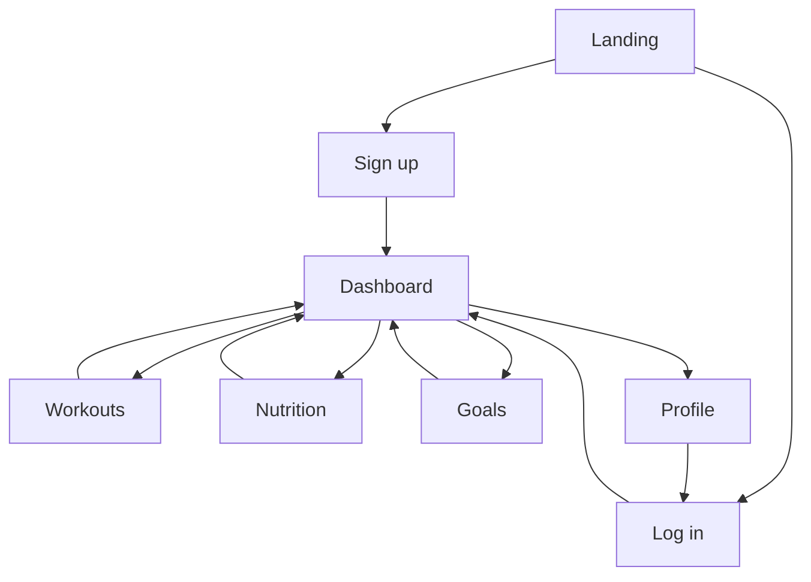

# User Journey Documentation

Sprint 3 deliverable (User Story #16). Narrative journeys that complement flowcharts in [../diagrams/user-workflows.md](../diagrams/user-workflows.md).

## Journey 1 — First-time user onboarding

**Persona:** New gym member who wants a private place to log fitness data.

| Step | User action | System response | Screen |
|------|-------------|-----------------|--------|
| 1 | Opens app URL | Landing page with login/signup links | Home |
| 2 | Clicks Sign up | Signup form with email, password, confirm | Signup |
| 3 | Submits valid credentials | Account created, session started | — |
| 4 | Lands on dashboard | Welcome message, empty summary cards | Dashboard |
| 5 | Explores nav | Can visit Workouts, Nutrition, Goals, Profile | Any |

**Success metric:** User reaches dashboard in under 2 minutes without confusion.

## Journey 2 — Daily workout logging

**Persona:** Returning user tracking a morning run.

| Step | User action | System response | Screen |
|------|-------------|-----------------|--------|
| 1 | Logs in | Session restored or new JWT issued | Login → Dashboard |
| 2 | Navigates to Workouts | Empty list or previous entries | Workouts |
| 3 | Clicks Add workout | Form: name, date, duration, notes | Workouts |
| 4 | Saves entry | Entry appears in list, sorted by date | Workouts |
| 5 | Returns to dashboard | Workout count or recent item updates | Dashboard |

**Edge cases:** Invalid duration shows inline error; network failure shows retry message.

## Journey 3 — Nutrition tracking for the day

**Persona:** User counting calories for lunch.

| Step | User action | System response | Screen |
|------|-------------|-----------------|--------|
| 1 | Opens Nutrition from nav | Daily log list (filterable by date later) | Nutrition |
| 2 | Adds food entry | Form: food name, calories, meal type, date | Nutrition |
| 3 | Saves | Entry listed; daily calorie subtotal (future) | Nutrition |
| 4 | Views dashboard | Nutrition summary card reflects new data | Dashboard |

## Journey 4 — Goal setting and progress check

**Persona:** User training for a weekly workout target.

| Step | User action | System response | Screen |
|------|-------------|-----------------|--------|
| 1 | Opens Goals | List of active goals or empty state | Goals |
| 2 | Creates goal | Title, category, target value, optional deadline | Goals |
| 3 | Logs workouts during the week | `currentValue` may update manually or via future automation | Workouts |
| 4 | Reviews goal on Goals page | Progress bar or fraction (target vs current) | Goals |
| 5 | Checks dashboard | Goal progress card shows status | Dashboard |

## Journey 5 — Profile and account review

**Persona:** User verifying account details.

| Step | User action | System response | Screen |
|------|-------------|-----------------|--------|
| 1 | Clicks Profile in nav | Shows email, display name | Profile |
| 2 | (Future) Updates display name | PATCH profile endpoint | Profile |
| 3 | Clicks Logout | Session cleared, redirect to login | Login |

## Cross-journey navigation map

## Journey vs implementation status

| Journey | Documented | UI shell | API + data |
|---------|------------|----------|------------|
| Onboarding | ✓ | ✓ | Sprint 4 |
| Workout logging | ✓ | Placeholder | Sprint 4–5 |
| Nutrition tracking | ✓ | Placeholder | Sprint 4–5 |
| Goal management | ✓ | Placeholder | Sprint 5 |
| Profile / logout | ✓ | Placeholder | Sprint 4 |

## Design consistency checklist (Sprint 3 refinement)

- [x] All authenticated pages share `AppLayout` navigation
- [x] Primary actions use emerald accent (Tailwind `emerald-600`)
- [x] Empty states explain what will appear and link to relevant section
- [ ] Forms use consistent label + input spacing (apply during Sprint 4 auth)
- [ ] Mobile nav collapses without hiding logout (Sprint 4)
